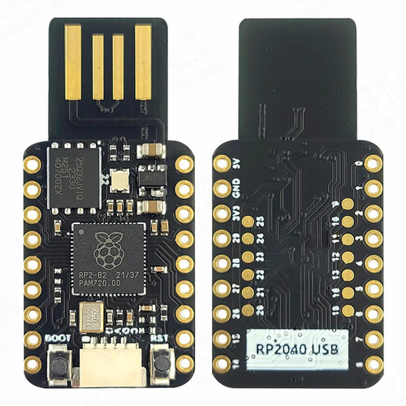

.. _mini_usb_rp2040-board:

Mini USB RP2040
###############

Overview
********

The `Mini USB RP2040`_ is a very small, low-cost and versatile Chinese board
from the official `AliExpress webshop of UICPAL`_. It has no SWD interface,
but a USB-A plug-in connector built directly into the PCB with a direct
connection to the RP2040 on-chip USB controller. The Raspberry Pi Pico
on-chip USB bootloader allows the ability to flash without any adapter,
in a drag-and-drop manner.

Hardware
********

- Dual core Arm Cortex-M0+ processor running up to 133MHz
- 264KB on-chip SRAM
- 4MB on-board QSPI flash with XIP capabilities
- 25 GPIO pins
- 4 Analog inputs
- 2 UART peripherals
- 2 SPI controllers
- 2 I2C controllers
- 16 PWM channels
- USB 1.1 controller (host/device)
- 8 Programmable I/O (PIO) for custom peripherals
- On-board digital LED WS2812 (NeoPixel)
- 1 Watchdog timer peripheral

Supported Features
==================

The ``mini_usb_rp2040`` board configuration supports the following
hardware features:

.. list-table:: Hardware Features Supported by Zephyr
   :class: longtable
   :align: center
   :header-rows: 1

   * - Peripheral
     - Kconfig option
     - Devicetree compatible
     - Zephyr API
   * - PINCTRL
     - :kconfig:option:`CONFIG_PINCTRL`
     - :dtcompatible:`raspberrypi,pico-pinctrl`
     - :zephyr:ref:`pinctrl_api`
   * - GPIO
     - :kconfig:option:`CONFIG_GPIO`
     - :dtcompatible:`raspberrypi,pico-gpio`
     - :zephyr:ref:`gpio_api`
   * - UART
     - :kconfig:option:`CONFIG_SERIAL`
     - :dtcompatible:`raspberrypi,pico-uart`
     - :zephyr:ref:`uart_api`
   * - UDC (USB Device Controller)
     - :kconfig:option:`CONFIG_USB_DEVICE_STACK`
     - :dtcompatible:`raspberrypi,pico-usbd`
     - :zephyr:ref:`usb_api`
   * - Flash
     - :kconfig:option:`CONFIG_FLASH`
     - :dtcompatible:`raspberrypi,pico-flash-controller`
     - :zephyr:ref:`flash_api` and
       :zephyr:ref:`flash_map_api`
   * - DMA
     - :kconfig:option:`CONFIG_DMA`
     - :dtcompatible:`raspberrypi,pico-dma`
     - :zephyr:ref:`dma_api`
   * - HWINFO
     - :kconfig:option:`CONFIG_HWINFO`
     - N/A
     - :zephyr:ref:`hwinfo_api`
   * - VREG
     - :kconfig:option:`CONFIG_REGULATOR`
     - :dtcompatible:`raspberrypi,core-supply-regulator`
     - :zephyr:ref:`regulator_api`
   * - RESET
     - :kconfig:option:`CONFIG_RESET`
     - :dtcompatible:`raspberrypi,pico-reset`
     - :zephyr:ref:`reset_api`
   * - CLOCK
     - :kconfig:option:`CONFIG_CLOCK_CONTROL`
     - | :dtcompatible:`raspberrypi,pico-clock-controller`
       | :dtcompatible:`raspberrypi,pico-clock`
     - :zephyr:ref:`clock_control_api`
   * - NVIC
     - N/A
     - :dtcompatible:`arm,v6m-nvic`
     - Nested Vector :zephyr:ref:`interrupts_v2` Controller
   * - SYSTICK
     - N/A
     - :dtcompatible:`arm,armv6m-systick`
     -

Pin Mapping
===========

The peripherals of the RP2040 SoC can be routed to various pins on the board.
The configuration of these routes can be modified through DTS. Please refer to
the datasheet to see the possible routings for each peripheral.

Since GPIO 22 is routed to the on-board digital LED (WS2812/NeoPixel) and there
is no additional simpler on-board LED, the "blinky" sample program does not work
on this board (use hello_world for a simple test program instead).

Default Zephyr Peripheral Mapping:
----------------------------------

.. rst-class:: rst-columns

- UART0_TX : GP0
- UART0_RX : GP1
- GPIO8 : GP8
- UART0_CTS : GP14 (optional, not default)
- UART0_RTS : GP15 (optional, not default)

Programming and Debugging
*************************

Flashing
========

Using UF2
---------

You can flash the Mini USB RP2040 with a UF2 file. By default, building an
application for this board will generate a :file:`build/zephyr/zephyr.uf2`
file. If the board is powered on with the ``BOOTSEL`` button pressed, it will
appear on the host as a mass storage device. The UF2 file should be
drag-and-dropped to the device, which will flash the board.

Debugging
=========

There is no SWD interface, thus debugging is not possible on thsi board.

Hello Shell on the USB Console (CDC/ACM)
========================================

.. zephyr-app-commands::
   :app: bridle/samples/helloshell
   :board: mini_usb_rp2040
   :build-dir: mini_usb_rp2040
   :west-args: -p
   :goals: flash
   :compact:

Simple test execution on target
-------------------------------

(text in bold is a command input)

   .. admonition:: System
      :class: note dropdown toggle-shown

      .. container:: highlight highlight-console notranslate

         .. parsed-literal::

            :bgn:`uart:~$` **hwinfo devid**
            Length: 8
            ID: 0xbd774b2618daaa7d

            :bgn:`uart:~$` **kernel version**
            Zephyr version |zephyr_version_number_em|

            :bgn:`uart:~$` **bridle version**
            Bridle version |shortversion_number_em|

            :bgn:`uart:~$` **bridle version long**
            Bridle version |longversion_number_em|

            :bgn:`uart:~$` **bridle info**
            Zephyr: |zephyr_release_number_em|
            Bridle: |release_number_em|

   .. admonition:: Devices
      :class: note dropdown

      .. container:: highlight highlight-console notranslate

         .. parsed-literal::

            :bgn:`uart:~$` **device list**
            devices:
            - clock-controller\ @\ 40008000 (READY)
              DT node labels: clocks
            - reset-controller\ @\ 4000c000 (READY)
              DT node labels: reset
            - cdc-acm-console-uart (READY)
              DT node labels: cdc_acm_console_uart
            - uart\ @\ 40034000 (READY)
              DT node labels: uart0
            - dma\ @\ 50000000 (READY)
              DT node labels: dma
            - gpio\ @\ 40014000 (READY)
              DT node labels: gpio0
            - flash-controller\ @\ 18000000 (READY)
              DT node labels: ssi
            - vreg\ @\ 40064000 (READY)
              DT node labels: vreg

   .. admonition:: Voltage Regulator
      :class: note dropdown

      .. rubric:: Operate with the on-chip voltage regulator unit:

      .. container:: highlight highlight-console notranslate

         .. parsed-literal::

            :bgn:`uart:~$` **regulator vlist vreg@40064000**
            0.800 V
            0.850 V
            0.900 V
            0.950 V
            1.000 V
            1.050 V
            1.100 V
            1.150 V
            1.200 V
            1.250 V
            1.300 V

      .. rubric:: Trigger a power-off/on sequence:

      .. container:: highlight highlight-console notranslate

         .. parsed-literal::

            :bgn:`uart:~$` **hwinfo reset_cause**
            reset caused by:
            - pin

            :bgn:`uart:~$` **regulator disable vreg@40064000**
            \*\*\* Booting Zephyr OS build |zephyr_version_em|\ *…* (delayed boot 4000ms) \*\*\*
            Hello World! I'm THE SHELL from mini_usb_rp2040

      .. container:: highlight highlight-console notranslate

         .. parsed-literal::

            :bgn:`uart:~$` **hwinfo reset_cause**
            reset caused by:
            - power-on reset

   .. admonition:: Flash Controller
      :class: note dropdown

      .. rubric:: Erase, Write and Verify

      .. container:: highlight highlight-console notranslate

         .. parsed-literal::

            :bgn:`uart:~$` **flash read flash-controller@18000000 e0000 40**
            000E0000: ff ff ff ff ff ff ff ff  ff ff ff ff ff ff ff ff \|........ ........\|
            000E0010: ff ff ff ff ff ff ff ff  ff ff ff ff ff ff ff ff \|........ ........\|
            000E0020: ff ff ff ff ff ff ff ff  ff ff ff ff ff ff ff ff \|........ ........\|
            000E0030: ff ff ff ff ff ff ff ff  ff ff ff ff ff ff ff ff \|........ ........\|

            :bgn:`uart:~$` **flash test flash-controller@18000000 e0000 1000 2**
            Erase OK.
            Write OK.
            Verified OK.
            Erase OK.
            Write OK.
            Verified OK.
            Erase-Write-Verify test done.

      .. rubric:: Details

      .. container:: highlight highlight-console notranslate

         .. parsed-literal::

            :bgn:`uart:~$` **flash read flash-controller@18000000 e0000 40**
            000E0000: 00 01 02 03 04 05 06 07  08 09 0a 0b 0c 0d 0e 0f \|........ ........\|
            000E0010: 10 11 12 13 14 15 16 17  18 19 1a 1b 1c 1d 1e 1f \|........ ........\|
            000E0020: 20 21 22 23 24 25 26 27  28 29 2a 2b 2c 2d 2e 2f \| !"#$%&' ()*+,-./\|
            000E0030: 30 31 32 33 34 35 36 37  38 39 3a 3b 3c 3d 3e 3f \|01234567 89:;<=>?\|

            :bgn:`uart:~$` **flash page_info e0000**
            Page for address 0xe0000:
            start offset: 0xe0000
            size: 4096
            index: 224

      .. rubric:: Revert

      .. container:: highlight highlight-console notranslate

         .. parsed-literal::

            :bgn:`uart:~$` **flash erase flash-controller@18000000 e0000 1000**
            Erase success.

            :bgn:`uart:~$` **flash read flash-controller@18000000 e0000 40**
            000E0000: ff ff ff ff ff ff ff ff  ff ff ff ff ff ff ff ff \|........ ........\|
            000E0010: ff ff ff ff ff ff ff ff  ff ff ff ff ff ff ff ff \|........ ........\|
            000E0020: ff ff ff ff ff ff ff ff  ff ff ff ff ff ff ff ff \|........ ........\|
            000E0030: ff ff ff ff ff ff ff ff  ff ff ff ff ff ff ff ff \|........ ........\|

References
**********

.. target-notes::

.. _`Mini USB RP2040`: https://aliexpress.com/item/1005006710298380.html
.. _`AliExpress webshop of UICPAL`: https://aliexpress.com/store/1102351032
