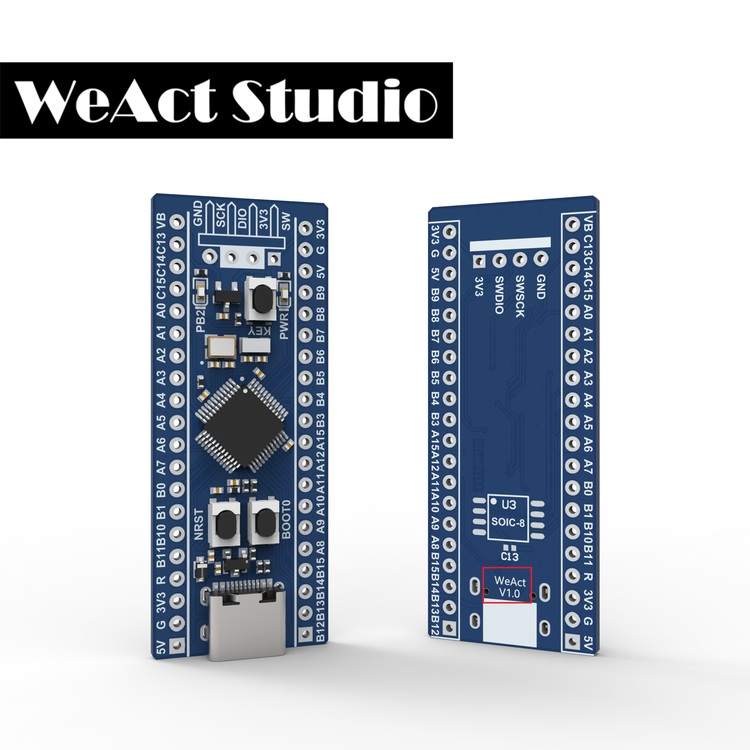
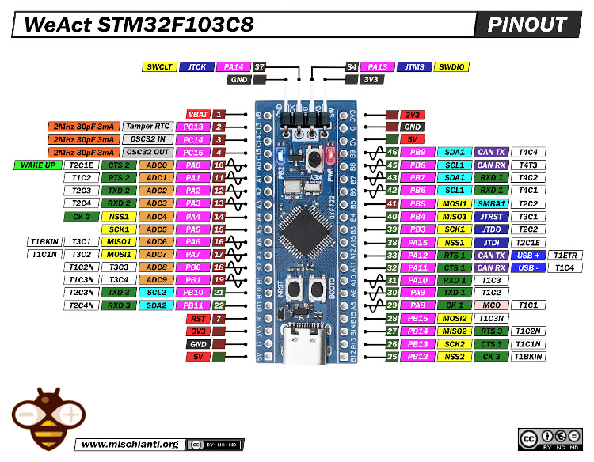

.. _bluepill_f103cb-board:

Blue Pill Plus V1.0
###################

Overview
********

The WeAct Blue Pill Plus V1.0 Board is an extremely low cost and bare-bones
development board featuring the STM32F103CB, see `STM32F103CB website`_.
This is the 48-pin variant of the STM32F103x series,
see `STM32F103x reference manual`_. More info about the board available
`here <stm32-base-board-page_>`_ and on `WeAct Github`_.

Hardware
********

The STM32F401CB based Blue Pill Plus V1.0 Board provides the following
hardware components:

- STM32F401CBT6 in LQFP48 package
- ARM\ |regs| 32-bit Cortex\ |regs| -M3 CPU with FPU
- 72 MHz max CPU frequency
- VDD from 2.0 V to 3.6 V
- 128 KB Flash
- 20 KB SRAM
- GPIO with external interrupt capability
- 2x12-bit, 1.0 MSPS ADC with 10 channels
- DMA Controller
- Up to 7 Timers (four 16-bit, two watchdog timers and a SysTick timer)
- USART/UART (3)
- I2C (2)
- SPI (2)
- CAN 2.0B
- USB 2.0 full-speed device controller with on-chip PHY
- CRC calculation unit
- 96-bit unique ID
- RTC

Supported Features
==================

The Zephyr blackpill_f401cc board configuration supports the following
hardware features:

+------------+------------+-------------------------------------+
| Interface  | Controller | Driver/Component                    |
+============+============+=====================================+
| NVIC       | on-chip    | nested vector interrupt controller  |
+------------+------------+-------------------------------------+
| SYSTICK    | on-chip    | system clock                        |
+------------+------------+-------------------------------------+
| UART       | on-chip    | serial port                         |
+------------+------------+-------------------------------------+
| GPIO       | on-chip    | gpio                                |
+------------+------------+-------------------------------------+
| PINMUX     | on-chip    | pinmux                              |
+------------+------------+-------------------------------------+
| FLASH      | on-chip    | flash                               |
+------------+------------+-------------------------------------+
| SPI        | on-chip    | spi                                 |
+------------+------------+-------------------------------------+
| I2C        | on-chip    | i2c                                 |
+------------+------------+-------------------------------------+
| ADC        | on-chip    | ADC Controller                      |
+------------+------------+-------------------------------------+
| USB OTG FS | on-chip    | USB device                          |
+------------+------------+-------------------------------------+

The default configuration can be found in
:bridle_file:`boards/weact/bluepill_f103cb/bluepill_f103cb_defconfig`

Pin Mapping
===========

Available pins:
---------------

Default Zephyr Peripheral Mapping:
----------------------------------

- USB_DN/USB_DP : PA11/PA12
- UART_1 TX/RX : PA9/PA10
- I2C1 SCL/SDA : PB8/PB9
- SPI1 CS/SCK/MISO/MOSI : PA4/PA5/PA6/PA7 (Routed to footprint for external flash)
- PWM_4_CH1 : PB6
- PWM_4_CH2 : PB7
- ADC_1 : PA1
- USER_PB : PA0 (Active high, needs pull-down resistance)
- USER_LED : PB2 (Active high)

Clock Sources
-------------

The board has two external oscillators. The frequency of the slow clock (LSE) is
32.768 kHz. The frequency of the main clock (HSE) is 8 MHz.

The default configuration sources the system clock from the PLL, which is
derived from HSE, and is set at 72MHz, which is the maximum possible frequency
to achieve a stable USB clock (48MHz).

Programming and Debugging
*************************

There are 2 main entry points for flashing STM32F1X SoCs, one using the ROM
bootloader, and another by using the SWD debug port (which requires additional
hardware). Flashing using the ROM bootloader requires a special activation
pattern, which can be triggered by using the BOOT0 pin.

Flashing
========

The board is configured to be flashed using west `STM32CubeProgrammer`_ runner,
so its :ref:`installation <stm32cubeprog-flash-host-tools>` is required.

Alternatively, OpenOCD, JLink or pyOCD can also be used to flash the board using
the ``--runner`` (or ``-r``) option:

.. code-block:: console

   $ west flash --runner openocd
   $ west flash --runner jlink
   $ west flash --runner pyocd

Flashing an Application
-----------------------

Here is an example for the :zephyr:code-sample:`hello_world` application.

Run a serial host program to connect with your Nucleo board.

.. code-block:: console

   $ minicom -b 115200 -D /dev/ttyACM0

Build and flash the application:

.. zephyr-app-commands::
   :app: zephyr/samples/hello_world
   :board: bluepill_f103cb
   :build-dir: bluepill_f103cb
   :west-args: -p
   :goals: flash
   :compact:

You should see the following message on the console:

.. code-block:: console

   $ Hello World! bluepill_f103cb

Debugging
=========

The board can be debugged by installing the included 100 mil (0.1 inch) header,
and attaching an SWD debugger to the 3V3 (3.3V), GND, SCK, and DIO
pins on that header.

More samples
************

On-board LED Blinky
===================

.. zephyr-app-commands::
   :app: zephyr/samples/basic/blinky
   :board: bluepill_f103cb
   :build-dir: bluepill_f103cb
   :west-args: -p
   :goals: flash
   :compact:

On-board LED by Push Button
===========================

.. zephyr-app-commands::
   :app: zephyr/samples/basic/button
   :board: bluepill_f103cb
   :build-dir: bluepill_f103cb
   :west-args: -p
   :goals: flash
   :compact:

Modular Shell
=============

.. zephyr-app-commands::
   :app: zephyr/samples/subsys/shell/shell_module
   :board: bluepill_f103cb
   :build-dir: bluepill_f103cb
   :west-args: -p
   :goals: flash
   :compact:

Bridle's Hello Shell
====================

.. zephyr-app-commands::
   :app: bridle/samples/helloshell
   :board: bluepill_f103cb
   :build-dir: bluepill_f103cb
   :conf: prj-hwstartup.conf
   :west-args: -p
   :goals: flash
   :compact:

When RAM overflow error occurs, try to disable the Flash memory controller:

.. zephyr-app-commands::
   :app: bridle/samples/helloshell
   :board: bluepill_f103cb
   :build-dir: bluepill_f103cb
   :conf: prj-hwstartup.conf
   :gen-args: -DCONFIG_FLASH=n -DCONFIG_FLASH_SHELL=n
   :west-args: -p
   :goals: flash
   :compact:

References
**********

.. target-notes::

.. _board release notes:
   https://github.com/WeActStudio/BluePill-Plus/blob/master/HDK/README.md

.. _WeAct Github:
   https://github.com/WeActStudio/BluePill-Plus

.. _stm32-base-board-page:
   https://stm32-base.org/boards/STM32F103C8T6-WeAct-Blue-Pill-Plus-Clone.html

.. _`STM32F103CB website`:
   https://www.st.com/en/microcontrollers/stm32f103cb.html

.. _`STM32F103x reference manual`:
   https://www.st.com/resource/en/reference_manual/cd00171190.pdf

.. _STM32CubeProgrammer:
   https://www.st.com/en/development-tools/stm32cubeprog.html
